# RealMesh - дизајн и архитектура

## Преглед пројекта
RealMesh је поједностављен, ефикасан mesh систем за Heltec V3 уређаје на EU 868MHz, дизајниран да реши проблеме загушења мреже у постојећим mesh решењима.

## Основна архитектура



### Адресирање чворова и хијерархија
- **Формат**: `чвор@подмрежа.област` (node@subnet.area)
- **Примери**: 
  - `никола1@београд.србија` (мобилни)
  - `чвор1@железник.београд` (стациони) 
  - `чвор2@железник.београд` (мобилни)
- **Намена**: Омогућава хијерархијско рутирање и локалну оптимизацију мреже
- **Самоодређивање**: Чворови сами бирају своје ID и подмрежу
- **Јединственост**: Чворови у истој подмрежи морају имати јединствене ID
  - Постојећи чворови обавештавају о конфликту имена
  - Чворови у конфликту морају променити ID пре прихватања
  - Само чворови са јединственим именима учествују у рутирању

### Типови чворова

#### Клијентски чворови
- **Функција**: Једноставан mesh режим без сложеног рутирања
- **Понашање**: Шаљу пакете и не брину где ће ићи ван локалне мреже
- **Меморија**: Не памте руте - раде у ad-hoc mesh режиму
- **Подмрежа**: Могу радити без подешене подмреже (аутоматски додељивање)
- **Мобилност**: Природно мобилни, могу се кретати између подмрежа

#### Магистрални чворови
- **Функција**: Рутирање између подмрежа и области
- **Ресурси**: Захтевају више меморије за табеле рута
- **Одговорност**: Памте руте само између других магистралних чворова
- **Филтрирање**: Контролишу шта излази из локалне мреже у глобалну
- **Типови**:
  - **Чисти магистрални**: Само рутирање
  - **Хибридни**: И клијент и магистрални функције

#### Комбиновани чворови
- **Случај употребе**: Мала група (планинари) која жели глобалну доступност
- **Функција**: Један чвор обавља и клијентску и магистралну улогу
- **Ограничења**: Делимична магистрална функционалност

## Стратегија рутирања

### Дводелна архитектура рутирања

#### Локални mesh (клијентски чворови)
- **Понашање**: Класичан mesh без сложеног рутирања
- **Хопови**: Ограничено на максимум 3 хопа (препорука: 1)
- **Без табела рута**: Клијенти не памте руте ван локалне мреже
- **Једноставност**: Минимални хардверски захтеви

#### Магистрално рутирање
- **Одговорност**: Само магистрални чворови раде међуподмрежно рутирање
- **Табеле**: Памте руте између подмрежа/области, не између свих чворова
- **Ефикасност**: Драстично смањене меморијске потребе

### Паметно откривање рута

#### На захтев (query-based)
```
Чвор1: "Ко има руту до @железник.београд?"
Магистрални: "Ја могу, 3 хопа, 150ms одзив"
```

#### Избегавање heartbeat загушења
- **Нема периодичних објава**: Супротно од Meshtastic heartbeat проблема
- **Реактивно**: Упити само када је потребна рута
- **Слушање**: Сви чворови ажурирају табеле на основу чутих одговора

#### Објаве промена (announce)
- **Нове везе**: Магистрални чвор објављује нове доступне подмреже
- **Губитак везе**: Обавештење о недоступним рутама
- **Ретко**: Дневне провере као резерва (ако нема саобраћаја)

### Складиштење рута

#### Магистрални чворови - компактне табеле
```
одредишна_подмрежа: железник.београд
релеј_чвор: чвор5@авала.београд
број_хопова: 3
просечно_време: 150ms
последња_употреба: timestamp
```

#### Више рута до истог одредишта
- **Резервне руте**: За отказивање главне
- **Статичке руте**: Планско подешавање за стабилну инфраструктуру
- **Динамичке**: Аутоматско откривање
- **Квалитет**: Праћење статистике успешности

### Аутоматско додељивање подмрежа
- **Клијенти без подмреже**: Магистрални чворови им додељују локалну подмрежу
- **Мобилност**: Аутоматска прена подмреже при кретању
- **Повратак одговора**: Могућ упркос промени локације

## Типови порука

### 1. Корисничке Поруке
- **Директне**: Приватне поруке између чворова
- **Јавни канали**: Broadcast поруке у каналима
- **Хитне**: Приоритетне поруке које прекидају остали саобраћај
- **Custom**: Кориснички дефинисани типови

### 2. Системске Поруке
- **ACK/NACK**: Потврде достављања
- **ROUTE_QUERY**: "Ко има руту до X?"
- **ROUTE_ANNOUNCE**: Објава нових/изгубљених рута
- **HEALTH_CHECK**: "Ко ме чује?" (ретко, на захтев)
- **CONTROL**: Управљање мрежом

### Конфигурабилни приоритети

#### Систем приоритета
- **Нумерички**: 0-255 (већи број = виши приоритет)
- **Подешавање по типу**: Сваки чвор може конфигурисати приоритете
- **Override**: Магистрални чворови могу мењати приоритете

#### Примери конфигурације
```
EMERGENCY: 255 (максимални)
DIRECT: 128 (средnji)
PUBLIC: 64 (низак)
CUSTOM_TYPE_A: 200 (високо за локалну мрежу)
CONTROL: 32 (системски)
```

#### Приоритетно деградирање
- **Магистрални филтер**: Custom типови се "пеглају" на глобалној мрежи
- **Локална слобода**: Висок приоритет у локалној подмрежи
- **Глобална дисциплина**: Умерен приоритет ван локалне мреже

## Управљање редовима и одбацивање порука

### Управљање редовима
- **Хитни ред**: Никад се не одбацује, увек се шаље први
- **Директни ред**: Ограничена величина (нпр. 10 порука), FIFO са одбацивањем по старости
- **Јавни ред**: Мала величина (нпр. 5 порука), агресивно одбацивање
- **Системски ред**: Планирано слање, може кашњење али не одбацивање

### Стратегије одбацивања
- **По старости**: Одбаци поруке старије од прага (нпр. 5 минута за chat)
- **По приоритету**: Одбаци нижи приоритет када су редови пуни
- **Детекција дуплирања**: Одбаци поновљене поруке (на основу hash-а)
- **Одговор на загушење**: Повећај агресивност одбацивања када је мрежа заузета

## Систем за чување порука

### Посебна архитектура за message store
- **Није посао чворова**: Краткорочно чување за поузданост ≠ дугорочно архивирање
- **Специјални хардвер**: Посебни чворови са ресурсима за чување
- **Стандардизовано**: Јединствен протокол за целу мрежу

### Типови message store чворова
- **BBS чворови**: Bulletin Board систем за јавне поруке
- **Mail чворови**: Лични сандучићи за приватне поруке  
- **Archive чворови**: Дугорочно чување за целе подмреже

### Транспарентност
- **Клијенту исто**: Исти протокол за слање/примање
- **Проширене могућности**: Краткорочно → дугорочно чување
- **Аутоматизација**: BBS апликације за аутоматско преузимање

## Откривање мреже

### Придружување новог чвора

#### Клијентски чвор
1. **Слушање**: 30 секунди слушања пре било какве активности
2. **Објава**: Broadcast `чвор@подмрежа` (или само `чвор` ако нема подмрежу)  
3. **Провера јединствености**: Постојећи чворови одговарају ако има конфликта
4. **Ауто-додељивање**: Ако нема подмрежу, магистрални чвор додељује локалну
5. **Интеграција**: Постепено учење локалне топологије

#### Магистрални чвор
1. **Откривање подмреже**: Идентификује локалне чворове
2. **Трагање за мостовима**: Активно тражи друге магистралне чворове  
3. **Успостављање рута**: Гради табеле рута до других подмрежа/области
4. **Објављивање**: Обавештава о новим доступним рутама

### Одржавање топологије

#### Реактивно vs проактивно
- **Query-driven**: "Ко има руту до X?" када је потребно
- **Event-driven**: Објаве када се топологија мења
- **Изузетно ретки heartbeat-ови**: Једном дневно као backup

#### Здравствене провере
- **"Ко ме чује?"**: На захтев или ретко аутоматски
- **Одговор**: Само директно чути чворови
- **Мануелно покретање**: Могућност ручне дијагностике

#### Детекција квара
- **Пасивно слушање**: Ако дуго нема одговора, провери здравље
- **Активна провера**: "Да ли си још ту?" специфичном чвору
- **Уклањање рута**: Брисање неодговорних рута из табела

## Управљање загушењем

### Back-off алгоритми
- **Експоненцијални back-off**: За неуспешне преносе
- **Насумични јитер**: Спречава синхронизоване ретрансмисије  
- **Слушање мреже**: Listen before transmit
- **Адаптивно кашњење**: Дуже паузе при већем загушењу

### Балансирање оптерећења
- **Избор рута**: Користи резервне руте када је главна загушена
- **Дистрибуција по подмрежама**: Рутирај кроз различите подмреже
- **Временско размицање**: Одложи не-хитне поруке током врхунца

### Магистрално филтрирање

#### Контрола саобраћаја
- **Типови порука**: Магистрални чвор може игнорисати одређене типове
- **Блокирани чворови**: Спречи одређене чворове да шаљу у глобалну мрежу
- **Промена приоритета**: "Пеглај" custom типове на глобалном нивоу

#### Премапирање канала
```
Локално:  Канал 5 = "Железник локални chat"
Глобално: Канал 5 = "Општи chat Србија"
→ Магистрални чвор мапира: Локални 5 → Глобални 1
```

#### Фреквенцијски мостови
- **Будућност**: Два радио модула повезана I2C/серијски
- **Различити профили**: MEDIUM_FAST ↔ LONG_SLOW  
- **Различите фреквенције**: 433MHz ↔ 868MHz
- **Јединствени протокол**: Преко серијске везе

## Серијска комуникација

### Једноставан интерфејс
- **Терминал програми**: Комуникација кроз било који серијски терминал
- **Без сложених протокола**: Једноставни команди и одговори
- **Дебаговање**: Лако праћење стања мреже и порука
- **Аутоматизација**: Могућност скриптовања

### Команде
```
SEND nikola@beograd "Помаже Бог!"
STATUS
ROUTES
WHO_HEARS_ME
DEBUG ON
```

## Техничке напомене за имплементацију

### За PoC
- **Један радио профил**: 125kHz, SF12 (максимум за домет)
- **Фокус на рутирање**: Интелигенција рутирања преко физичке оптимизације  
- **Heltec V3 ESP32**: Циљна платформа
- **EU 868MHz**: Фреквенцијски опсег

### Будућа побољшања
- **Више профила преноса**: FAST/MEDIUM/SLOW профили
- **Напредни алгоритми за загушење**: Адаптивно управљање
- **Предикција мобилности**: Предвиђање кретања мобилних чворова
- **Cross-frequency координација**: Мостови између фреквенција

### Радио конфигурација (флексибилна)
- **Фреквенција**: 868MHz (EU опсег) 
- **Bandwidth**: 125kHz (максимум за домет)
- **Spreading Factor**: SF12 (максимална сензитивност)
- **Coding Rate**: 4/5 (добра корекција грешака)
- **TX Power**: 20dBm (максимално дозвољено)
- **Preamble**: 8 символа
- **Sync Word**: 0x12 (приватна мрежа)

## Безбедност и аутентификација

### Аутентификација порука
- **Директне поруке**: Енкриптоване public-private кључевима
- **Јавне поруке**: Неенкриптоване (broadcast природа)  
- **Верификација чвора**: На основу поверења у ACK одговоре
  - Ако чвор потврђује re-broadcast, верујемо му рутну способност
  - Неуспешни ACK-ови смањују поверење и активирају алтернативе

### Стратегија енкрипције
- **Само приватне поруке**: Директна комуникација између чворова енкриптована
- **Јавни канали**: Остају неенкриптовани за ефикасност мреже
- **Размена кључева**: Чворови размењују јавне кључеве при иницијалном handshake

## Формат пакета порука

### Структура заглавља
- **Network ID**: 32-bit идентификатор мреже
- **Area ID**: 32-bit идентификатор области (опционо за хијерархију)
- **Message ID**: 32-bit инкрементални број за tracking
- **Source**: Пуна адреса пошаљиоца `чвор@подмрежа.област`
- **Destination**: Одредишна адреса (или @подмрежа за локални broadcast)
- **Message Type**: Нумерички (системски 0-127, custom 128-255)
- **Priority**: 8-bit нумеричка вредност (0-255)
- **Hop Count**: Праћење дистанце пропагације
- **Timestamp**: За одбацивање по старости и сортирање

### Ограничења payload-а
- **Максимални payload**: 200 bytes (заглавље + садржај поруке)
- **Overhead заглавља**: ~40 bytes (због хијерархије)  
- **Ефективна величина**: ~160 bytes за кориснички садржај

### Генерисање message ID
- **Поједностављено**: Инкрементални 32-bit број по чвору
- **Јединственост**: Адреса + ID = глобално јединствено
- **Циклус**: Враћа се на 0 након MAX_UINT32
- **Без hash-ова**: Непотребна сложеност уклоњена

### Рутирање метаподаци
- **Историја path-а**: Последња 3 хопа за спречавање петљи
- **Метрике квалитета**: Јачина сигнала, број покушаја
- **Тајминг инфо**: Timestamp преноса за мерење латенције
- **Hop ограничење**: 
  - Mesh: Максимум 3 хопа (препорука 1)
  - Рутирање: Без ограничења

## Решавање конфликата

### Конфликт имена и идентитет чвора
- **Перзистентни идентитет**: Сваки чвор генерише скривени UUID при првом покретању
- **Формат**: `никдале1@чукарица_a81f` (јавно име + скривени суфикс)
- **Решавање конфликта**: 
  - Активни чвор увек побеђује у правима на име
  - Offline чворови губе име након 72 сата неактивности
  - Чворови који се враћају преузимају име користећи UUID
  - UUID спречава имперсонацију чворова који се враћају

### Више магистралних чворова
- **Кооперативни приступ**: Више магистралних чворова у истој подмрежи је корисно
- **Дистрибуција оптерећења**: Оба могу rebroadcast и служити као рутни чворови
- **Резервност**: Backup рутирање ако један чвор откаже
- **Координација**: Чворови деле табеле рута и координирају се да спрече петље

### Механизми за разрешавање
- **Јачина сигнала**: Јачи сигнал побеђује у рутирању
- **Време одзива**: Бржи ACK одговори имају предност
- **Број хопова**: Краће руте су преферисане
- **Старост чвора**: Старији чворови имају благу предност

## Мрежни bootstrap и опоравак

### Хладни старт
- **Понашање првог чвора**: Понаша се као оснивач подмреже
- **Откривање других подмрежа**: Активно тражи друге подмреже за мостове
- **Успостављање ауторитета**: Постаје почетни рутни ауторитет за подмрежу

### Придружување мрежи
- **Стратегија поновних покушаја**: 3 покушаја са експоненцијалним back-off (1s, 3s, 9s)
- **Fallback**: Ако нема одговора, претпостави да си први чвор у подмрежи
- **Период откривања**: 30 секунди слушања пре захтевања статуса оснивача

### Опоравак од изолације
- **Поновно повезивање**: Користи исти UUID-based процес враћања идентитета
- **Поновна изградња рута**: Постепено поново откривање путања кроз покушаје слања порука
- **Приоритетни опоравак**: Хитне и директне поруке имају приоритет рутирања током опоравка

## Хитне поруке (PoC поједностављено)
- **Квалификација**: Било која порука означена као хитна од било kog чвора
- **Ауторизација**: Нема ограничења за PoC - свако може слати хитне поруке
- **Валидација**: Нема спречавања spam-а за PoC (систем на основу поверења)
- **Понашanje**: Тренутни пренос, прекида остали саобраћај, flood рутирање

## Технички параметри

### Меморија и тајминг
- **Табеле рута**: Користи доступну RAM (типично 4000+ уноса на ESP32)
  - **Магистрални**: Максимално искоришћење меморије  
  - **Клијентски**: Минимално чување рута
- **ACK timeout**: 10 секунди за директне, 30 секунди за flood
- **Интервали поновних покушаја**: 5s, 15s, 45s (експоненцијални back-off)
- **Период здравствених провера**: Дневно или на захтев (НИКАД heartbeat spam!)
- **Старење порука**: Одбаци chat поруке старије од 10 минута

### Домет и претпоставке мреже  
- **Директна видљивост**: ~5-15km у зависности од терена
- **Урбано окружење**: ~1-3km са препрекама
- **Пречник мреже**: 
  - **Mesh**: Максимум 3 хопа (препорука 1)
  - **Рутирано**: Без ограничења
- **Праг загушења**: >80% искоришћености канала активира агресивно одбацивање

## Грациозна деградација (PoC стратегија)

### Руковање преоптерећењем
- **Приоритизација редова**: Хитни > Директни > Јавни > Систем
- **Агресивно одбацивање**: Прво одбаци јавни chat, затим старе поруке
- **Back-pressure**: Повећај кашњења када је мрежа заузета

### Парцијални отказ
- **Поништавање рута**: Уклони неуспешне путање одмах
- **Fallback стратегија**: Директно → Посредник → Flood
- **Опоравак**: Постепено поново откривање рута кроз успешне покушаје

### Опоравак од партиције мреже
- **Аутоматско премошћавање**: Чворови активно траже cross-subdomain везе
- **Објављивање рута**: Магистрални чворови broadcast способности моста
- **Самоисцељење**: Мрежа се природно лечи како се мобилни чворови крећу

## Отворена питања  

1. **Cross-subdomain оптимизација**: Напредно рутирање између далеких подмрежа
2. **Тунирање перформанси**: Реална оптимизација параметара тајминга
3. **Тестирање скале**: Понашање са 100+ чворова у јединственој подмрежи
4. **Терминологија**: Стандардизација термина за јасну комуникацију

## Следећи кораци

1. **Дефиниши формат пакета**: Финализуј структуру заглавља
2. **Имплементирај основни LoRa слој**: Radio layer са РоС параметрима
3. **Направи структуре табела рута**: Компактне табеле за магистралне чворове
4. **Развиј алгоритме учења рута**: Query-based откривање
5. **Изгради систем за загушење**: Адаптивно управљање саобраћајем
6. **Тестирај архитектуру**: Клијент/Магистрални подела одговорности

## Закључак

Овај дизајн решава кључне проблеме постојећих mesh система:
- **Скалабилност**: Клијент/Магистрални подела смањује меморијске захтеве
- **Ефикасност**: Query-based рутирање уместо heartbeat спама
- **Флексибилност**: Конфигурабилни приоритети и custom типови порука  
- **Једноставност**: Клијенти раде без сложеног рутирања
- **Проширивост**: Хијерархијска адресна шема за будући раст